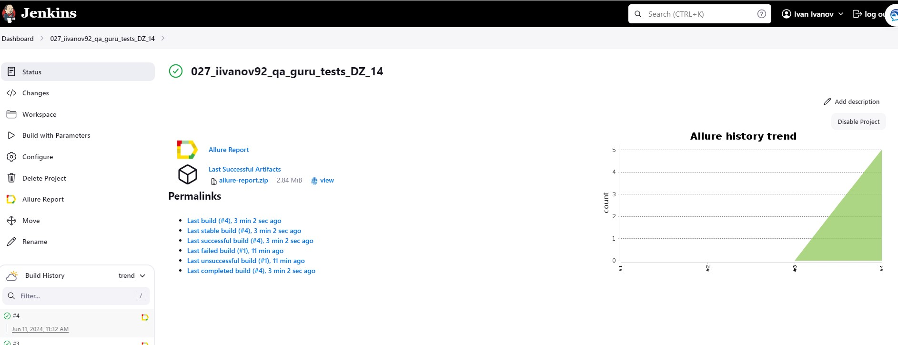

# Демопроект по автоматизации тестирования сайта **[Альфа-Банка](https://alfabank.ru)**

---

## Содержание

---
- Технологии и инструменты
- Список проверок, реализованных в тестах
- Запуск тестов (сборка в Jenkins) и из терминала
- Allure-отчет
- Уведомление в Telegram о результатах прогона тестов
- Видео пример прохождения тестов

### Технологии и инструменты

---
           

### Список проверок, реализованных в тестах

---

- Проверка наличия и кликабельности кнопки 'Получить карту' на главной страницы
- Проверка меню калькулятора, возможность выбрать разные калькуляторы
- Проверка раздела "Выбирайте лучшее" -> меню "Для всех"
- Проверка раздела "Выбирайте лучшее" -> меню "Крупному бизнесу"
- Проверка раздела "Выбирайте лучшее" -> меню "Малому бизнесу"

### Сборка в Jenkins

---

          